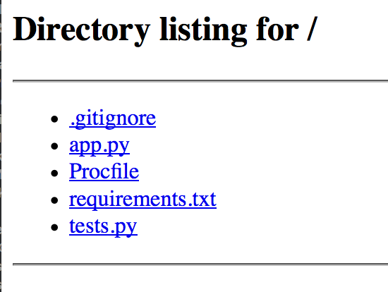

<!SLIDE>
# Container Networking Basics

Now we've seen the basics of running containers in the background
let's look at a more complex (and useful!) example.

To do this we're going to build a web server in a container running
detached in the background.

<!SLIDE>
# Running our web server container

Let's start by creating our new container.

    @@@ Sh
    $ docker run -d -p 80 training/webapp python -m SimpleHTTPServer 80
    72bbff4d768c52d6ce56fae5d45681c62d38bc46300fc6cc28a7642385b99eb5

* We've used the ``-d`` flag to detach the container.
* The ``-p`` flag exposes port ``80`` in the container.
* We've used the ``training/webapp`` image, which happens to have Python.
* We've used Python to create a web server.

<!SLIDE>
# Checking the container is running

Let's look at our running container.

    @@@ Sh
    $ docker ps
    CONTAINER ID  IMAGE  COMMAND  CREATED  STATUS  PORTS                  NAMES
    72bbff4d768c  ...    ...      ...      ...     0.0.0.0:49153->80/tcp  ...

* The ``-p`` flag maps a random high port, here ``49153`` to port ``80``
  inside the container. We can see it in the ``PORTS`` column.

* The other columns have been scrubbed out for legibility here.

<!SLIDE>
# The ``docker port`` shortcut

We can also use the ``docker port`` command to find our mapped port.

    @@@ Sh
    $ docker port <yourContainerID> 80
    0.0.0.0:49153

We specify the container ID and the port number for which we wish to
return a mapped port.

We can also find the mapped network port using the ``docker inspect``
command.

    @@@ Sh
    $ docker inspect -f "{{ json .NetworkSettings.Ports }}" <yourContainerID>
    {"5000/tcp":null,"80/tcp":[{"HostIp":"0.0.0.0","HostPort":"49153"}]}

<!SLIDE>
# Viewing our web server

We open a web browser and view our web server on ``<yourHostIP>:<portNumber>``.

<!SLIDE>
# Container networking basics

* You can map ports automatically.
* You can also manually map ports.

        @@@ Sh
        $ docker run -d -p 8080:80 training/webapp \
        python -m SimpleHTTPServer 80

  The ``-p`` flag takes the form:

        @@@ Sh
        host_port:container_port

  This maps port ``8080`` on the host to port ``80`` inside the container.

* Note that this style prevents you from spinning up multiple instances of 
the same image (the ports will conflict).

* Containers also have their own private IP address.

<!SLIDE>
# Finding the container's IP address

We can use the ``docker inspect`` command to find the IP address of the
container.

    @@@ Sh
    $ docker inspect --format '{{ .NetworkSettings.IPAddress }}' <yourContainerID>
    172.17.0.3

* We've again used the  ``--format`` flag which selects a portion of the
  output returned by the ``docker inspect`` command.

* The default network used for Docker containers is 172.17.0.0/16.

    If it is already in use on your system, Docker will pick another one.

<!SLIDE>
# Pinging our container

We can test connectivity to the container using the IP address we've
just discovered. Let's see this now by using the ``ping`` tool.

    @@@ Sh
    $ ping <ipAddress>
    64 bytes from <ipAddress>: icmp_req=2 ttl=64 time=0.085 ms
    64 bytes from <ipAddress>: icmp_req=2 ttl=64 time=0.085 ms
    64 bytes from <ipAddress>: icmp_req=2 ttl=64 time=0.085 ms

<!SLIDE>
# Stopping the container

Now let's stop the running container.

    @@@ Sh
    $ docker stop <yourContainerID>

<!SLIDE>
# Removing the container

Let's be neat and remove our container too.

    @@@ Sh
    $ docker rm <yourContainerID>

<!SLIDE>
# Section summary

We've learned how to:

* Expose a network port.
* Manipulate container networking basics.
* Find a container's IP address.
* Stop and remove a container.

**NOTE: Later on we'll see how to network containers without exposing ports
using the ``link`` primitive.**

<!SLIDE supplemental exercises>
# Lab ~~~SECTION:MAJOR~~~.~~~SECTION:MINOR~~~: Create a container

1. Create a new container.

         @@@ Sh
         $ docker run -d -p 80 training/webapp python -m SimpleHTTPServer 80

2. Make a note of the container ID.

3. Check the container is running.

         @@@ Sh
         $ docker ps

<!SLIDE supplemental exercises>
# Lab ~~~SECTION:MAJOR~~~.~~~SECTION:MINOR~~~: Checking the container's port mapping

1. Retrieve the container's port mapping.

         @@@ Sh
         $ docker port <yourContainerId> 80

2. Note also that you can get this information using ``docker inspect -f``:

         @@@ Sh
         $ docker inspect -f "{{ json .NetworkSettings.Ports }}" <yourContainerID>
         {"5000/tcp":null,"80/tcp":[{"HostIp":"0.0.0.0","HostPort":"49153"}]}

2. Make a note of the port number returned.

<!SLIDE supplemental exercises>
# Lab ~~~SECTION:MAJOR~~~.~~~SECTION:MINOR~~~: Browse to the web server

1. Browse to the URL.

        @@@ Sh
        http://<yourHostIP>:<portNumber>

2. You should see a directory listing for your container.

<!SLIDE supplemental exercises>
# Lab ~~~SECTION:MAJOR~~~.~~~SECTION:MINOR~~~: Finding the container's IP address

1. Now retrieve the container's IP address.

        @@@ Sh
        $ docker inspect --format \
          '{{ .NetworkSettings.IPAddress }}' \
          <yourContainerId>

2. Make a note of the IP address returned.

3. Ping the IP address.

        @@@ Sh
        $ ping <ipAddress>

4. You should see a response.

        @@@ Sh
        64 bytes from <ipAddress>: icmp_req=2 ttl=64 time=0.085 ms
        64 bytes from <ipAddress>: icmp_req=2 ttl=64 time=0.085 ms
