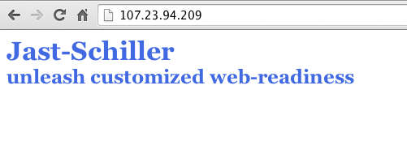
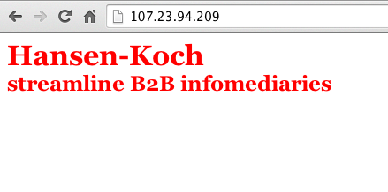

<!SLIDE>
# Using a Docker container for local development

Docker containers are perfect for local development.

Let's grab an image with a web application and see how this works.

     @@@ Sh
     $ docker pull training/namer

<!SLIDE>
# Our namer image

Our ``training/namer`` image is based on the Ubuntu image.

It contains:

* Ruby.
* Sinatra.
* Required dependencies.

<!SLIDE>
# Adding our source code

Let's download our application's source code.

    @@@ Sh
    $ git clone https://github.com/docker-training/namer.git
    $ cd namer
    $ ls
    company_name_generator.rb  config.ru  Dockerfile  Gemfile  README.md

<!SLIDE>
# Creating a container from our image

We've got an image, some source code and now we can add a container to
run that code.

    @@@ Sh
    $ docker run -d \
          -v $(pwd):/opt/namer \
          -p 80:9292 \
          training/namer \
          rackup

* The ``-d`` flag indicates that the container should run in detached mode (in the background).
* The ``-v`` flag provides volume mounting inside containers.
* The ``-p`` flag maps port ``9292`` inside the container to port ``80`` on the host.
* ``training/namer`` is the name of the image we will run.
* ``rackup`` is the name of the command we run (it is a ruby server).

More on these later.

We've launched the application with the ``training/namer`` image and the ``rackup`` command.

<!SLIDE>
# Mounting volumes inside containers

The ``-v`` flag mounts a directory from your host into your Docker
container. The flag structure is:

    @@@ Sh
    [host-path]:[container-path]:[rw|ro]

* If [host-path] or [container-path] doesn't exist it is created.
* You can control the write status of the volume with the ``ro`` and
  ``rw`` options.
* If you don't specify ``rw`` or ``ro``, it will be ``rw`` by default.

<!SLIDE>
# Checking our new container

Now let us see if our new container is running.

    @@@ Sh
    $ docker ps
    CONTAINER ID  IMAGE                 COMMAND CREATED       STATUS       PORTS                NAMES
    045885b68bc5  training/namer:latest rackup  3 seconds ago Up 3 seconds 0.0.0.0:80->9292/tcp condescending_shockley

<!SLIDE>
# Viewing our application

Now let's browse to our web application on:

    @@@ Sh 
    http://<yourHostIP>:80

We can see our company naming application. 

<!SLIDE>
# Making a change to our application

Our customer really doesn't like the color of our text. Let's change it.

    @@@ Sh
    $ vi company_name_generator.rb

And change

    @@@ CSS
    color: royalblue;

To:

    @@@ CSS
    color: red;

<!SLIDE>
# Refreshing our application

Now let's refresh our browser:

    @@@ Sh
    http://<yourHostIP>:80

We can see the updated color of our company naming application.

<!SLIDE>
# Workflow explained

We can see a simple workflow:

1. Build an image containing our development environment.

    (Rails, Django...)

2. Start a container from that image.

    Use the ``-v`` flag to mount source code inside the container.

3. Edit source code outside the containers, using regular tools.

    (vim, emacs, textmate...)

4. Test application.

    (Some frameworks pick up changes automatically.

    Others require you to Ctrl-C + restart after each modification.)

5. Repeat last two steps until satisfied.

6. When done, commit+push source code changes.

    (You *are* using version control, right?)

<!SLIDE>
# Stopping the container

Now we're done let's stop our container.

    @@@ Sh
    $ docker stop <yourContainerID>

And remove it.

    @@@ Sh
    $ docker rm <yourContainerID>

<!SLIDE>
# Section summary

We've learned how to:

* Share code between container and host.
* Set our working directory.
* Use a simple local development workflow.

<!SLIDE supplemental exercises>
# Lab ~~~SECTION:MAJOR~~~.~~~SECTION:MINOR~~~: Pull down our application image

1. Pull down our application image.

         @@@ Sh
         $ docker pull training/namer

<!SLIDE supplemental exercises>
# Lab ~~~SECTION:MAJOR~~~.~~~SECTION:MINOR~~~: Download the application's source code

1. Download the application source code.

        @@@ Sh
        $ git clone https://github.com/docker-training/namer.git

2. Review the contents of the ``namer`` directory.

        @@@ Sh
        $ cd namer
        $ ls

<!SLIDE supplemental exercises>
# Lab ~~~SECTION:MAJOR~~~.~~~SECTION:MINOR~~~: Create a container from our application image.

1. Create a new container (make sure that you are in ``namer`` directory first).

        @@@ Sh
        $ docker run -d \
              -v $(pwd):/opt/namer \
              -p 80:9292 \
              training/namer \
              rackup

2. Check the container is running.

        @@@ Sh 
        $ docker ps

<!SLIDE supplemental exercises>
# Lab ~~~SECTION:MAJOR~~~.~~~SECTION:MINOR~~~: Update the running application

1. Use your local browser to check the running application.

        @@@ Sh
        http://<yourHostIP>

2. Edit the ``namer/company_name_generator.rb`` file.

        @@@ Sh
        $ vim namer/company_name_generator.rb

3. Change the ``color`` CSS property in the ``

4. Refresh the browser to see the color change.

        @@@ Sh
        http://<yourHostIP>

<!SLIDE supplemental exercises>
# Lab ~~~SECTION:MAJOR~~~.~~~SECTION:MINOR~~~: Stop and remove the container

1. Stop the running container.

         @@@ Sh
         $ docker stop <yourContainerId>

2. Remove the container.

          @@@ Sh
          $ docker rm <yourContainerId>

